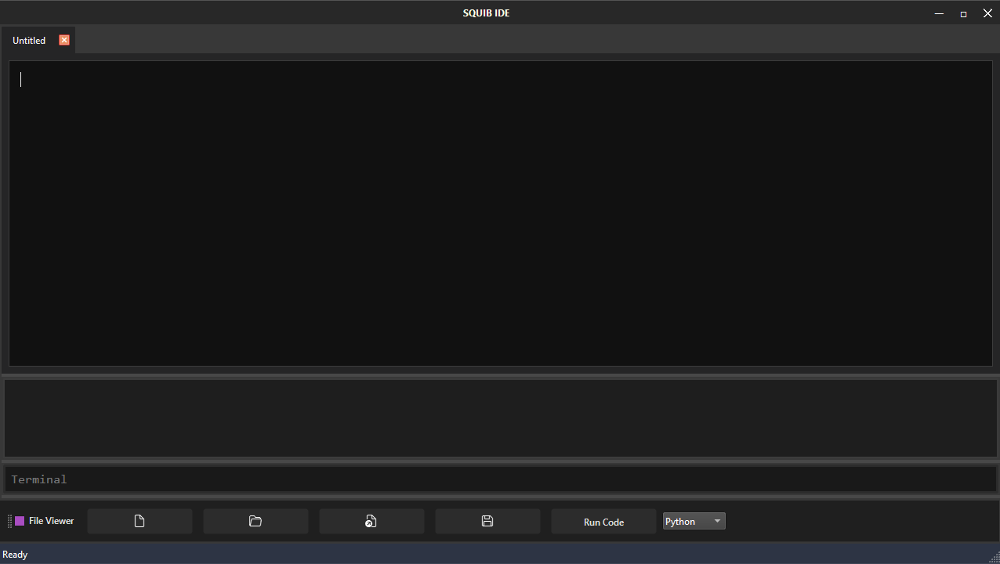

# Bare-PyQt-Code-Editor

## This is a bare Code Editor written in python
***There is definitely some changes to be made, and code to be cleaned.***
But I'm pretty happy with how it turned out

_This is the Welcome Screen, listed as **components/welcome_widget.py.**_

_This is the blank editor found in **components/code_editor.py.**_

_This is the editor with some code written, highlighting done in **components/python_highlighter.py.**_

### I used PyQt6 for this project, I had contrained my time to 2 days for this!
### I think it turned out pretty well, I think I'll add some togglable vim controls for myself.